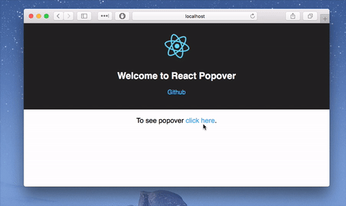

<div align="center">
 <h1>React Simple Popover</h1>
 <p>
  Totally controlled popover component based on <a href="https://github.com/react-bootstrap/react-overlays">React Overlays</a>.
 </p>

 
 
 <a href="https://www.webpackbin.com/bins/-KiVPQd-vT8slT-uPkq_">Try yourself</a>
</div>

## Install
```bash
 $ npm install react-simple-popover
```


## Usage
```js
import Popover from 'react-simple-popover';
import React, { Component } from 'react';

class PopoverDemo extends Component {
  constructor(props) {
    super(props);
    this.state = {
      open: false
    };
  }

  handleClick(e) {
    this.setState({open: !this.state.open});
  }

  handleClose(e) {
    this.setState({open: false});
  }

  render() {
    return (
      <div>
        <a
          href="#"
          className="button"
          ref="target"
          onClick={this.handleClick.bind(this)}>Popover</a>
        <Popover
          placement='left'
          container={this}
          target={this.refs.target}
          show={this.state.open}
          onHide={this.handleClose.bind(this)} >
          <p>This is popover</p>
        </Popover>
      </div>
    );
  }
}
```

## Options

**placement**  
One of `left`, `right`, `bottom` or `top`.

**show**  
Boolean, `true` if popover is shown; `false` otherwise.

**onHide**  
Hide callback function.

**target**  
Target ref to align popover around target element.

**container**  
Reference to the component that represents the context

**hideWithOutsideClick**  
Boolean, `true` if popover should hide when clicked outside; `false` otherwise.

**containerStyle**  
Style for outermost container

**style**  
Style for the content's container 


## Author
Ismail Demirbilek - [@dbtek](https://twitter.com/dbtek)  
MIT Licensed
